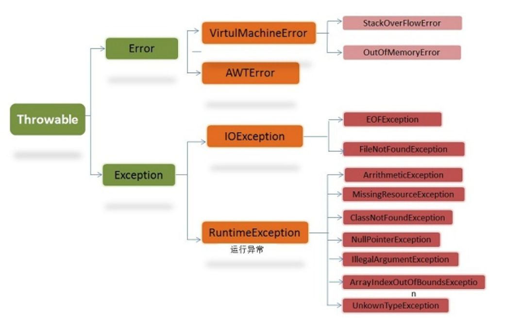

# Java异常处理

## 1. Java 异常类层次结构图



在Java中，所有的异常都有一个共同的祖先java.lang包中的**Throwable类**。Throwable: 有两个重要的子类：**Exception（异常）**和 **Error（错误）**，二者都是Java异常处理的重要子类，各自都包含了大量子类

### 1.1 Error（错误）

**error 是程序无法处理的错误**，表示运行应用程序中较严重问题。大多数错误与代码编写者执行的操作无关，而表示**代码运行时 JVM(Java虚拟机)出现的问题**。

>例如，Java虚拟机运行时错误（Virtual MachineError），当JVM 不再有继续执行操作所需要的内存资源时，将出现OutOfMemoryError。这些异常发生时，Java虚拟机（JVM）**一般会选择线程终止**
>
>这些错误表示故障发生于虚拟机自身，或者发生在虚拟机试图执行应用时，如Java虚拟机运行错误（Virtual MachineError）、类定义错误（NoClassDefFoundError）等。这些错误是不可查的，因为它们在应用程序的控制和处理能力之 外，而且绝大多数是程序运行时不允许出现的状况。对于设计合理的应用程序来说，即使确实发生了错误，本质上也不应该试图去处理它所引起的异常状况。在 Java中，错误通过Error的子类描述。

### 1.2 Exception(异常)

Exception(异常) 是**程序本身可以处理的异常**。

Exception类有一个重要的子类 **RuntimeException**。RuntimeException异常由java虚拟机抛出。**NullPointerException**（要访问的变量没有引用任何对象时，抛出该异常）、**ArithmeticException**（算术运算异常，一个整数除以0时，抛出该异常）和 **ArrayIndexOutOfBoundsException** （下标越界异常）。

注意：**异常和错误的区别：异常能被程序本身处理，错误是无法处理的**

## 2. 异常处理总结

- **try块**：用于捕获异常。其后可接零个或多个catch块，如果没有catch块，则必须跟一个finally块
- **catch块**：用于处理try捕获的异常
- **finally块**：无论是否捕获或处理异常，finally块里的语句都会被执行。当在try块或catch块中遇到return语句时，finally语句将在方法返回之前被执行

### 2.1 在什么情况下finally块不会被执行

1. 在finally 语句块第一行发生了异常。因为在其他行，finally块还是会得到执行
2. 在前面的代码中调用了System.exit(int) 已退出程序，若该语句在异常语句之后，finally会执行
3. 程序所在的线程死亡
4. 关闭CPU

### 2.2 try语句和finally语句都有return的情况

当try语句和finally 语句中都有return 语句时，**在方法返回之前，finally语句的内容将被执行**，**并且finally 语句的返回值将会覆盖原始的返回值**

```java
  public static int f(int value) {
        try {
            return value * value;
        } finally {
            if (value == 2) {
                return 0;
            }
        }
    }
```

如果调用f(2),返回值将是0，因为finally语句的返回值覆盖了try语句块的返回值