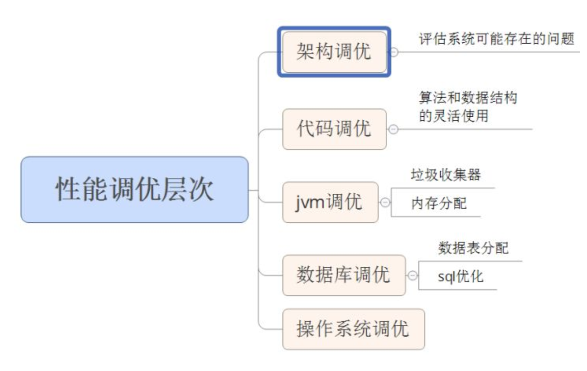
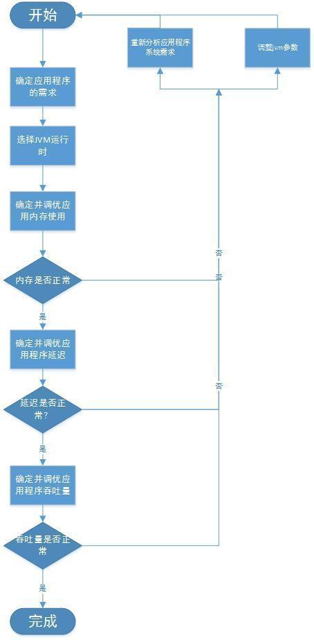
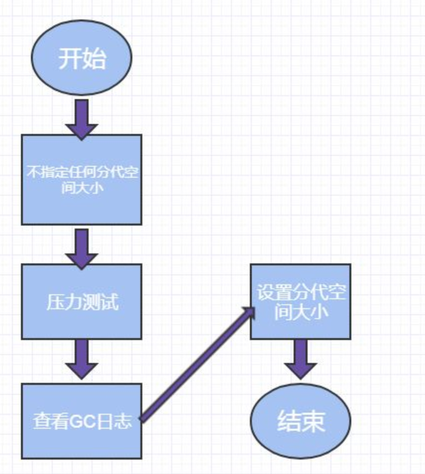
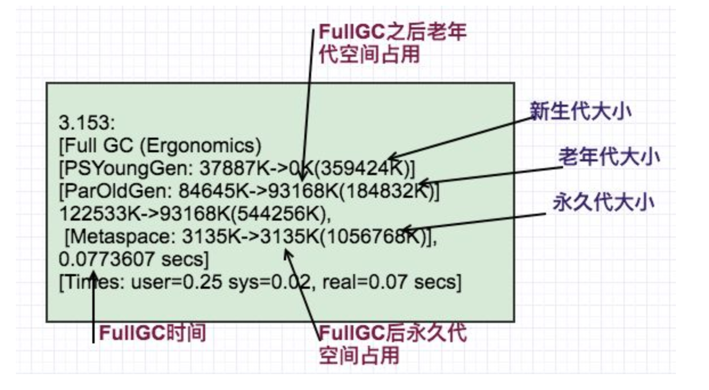
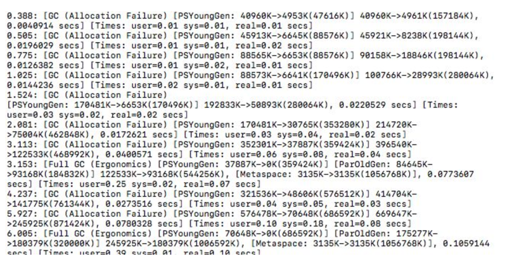
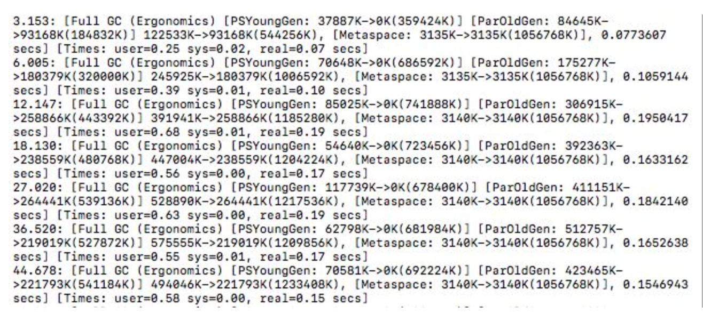
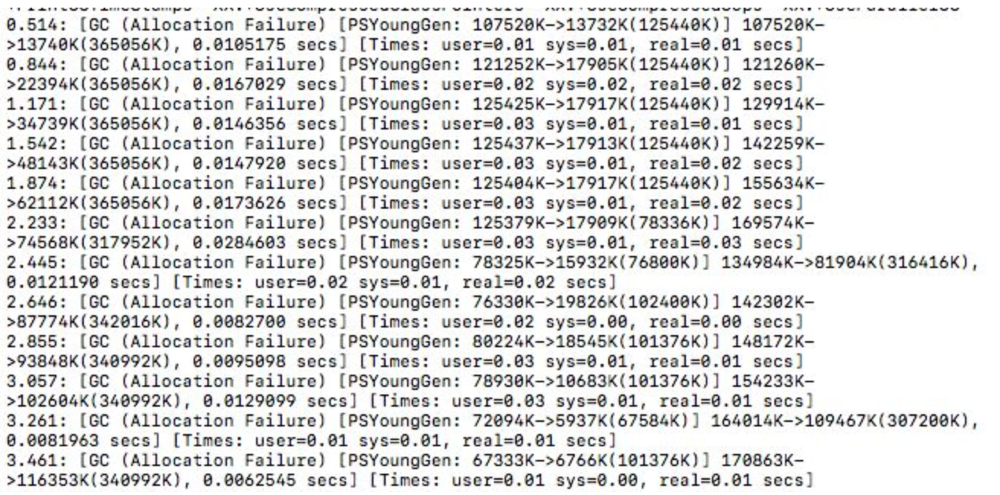
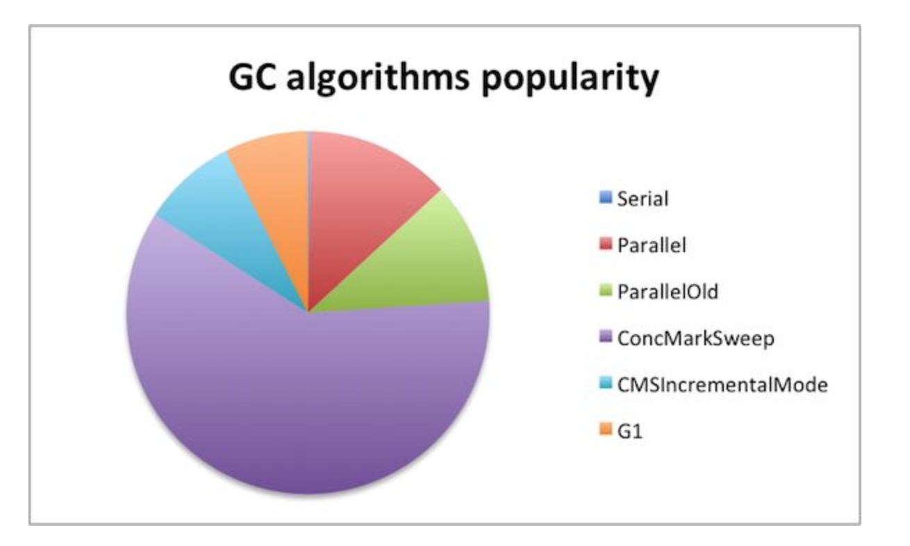

# 如何合理的规划 JVM 性能调优

JVM性能调优涉及到方方面面的取舍，往往是牵一发而动全身，需要全盘考虑各方面的影响。但也有一些基础的理论和原则，理解这些理论并遵循这些原则会让你的性能调优任务将会更加轻松。为了更好的理解本篇所介绍的内容。你需要已经了解和遵循以下内容:

> 1、已了解jvm 垃圾收集器
> 2、已了解jvm 性能监控常用工具
> 3、能够读懂gc日志
> 4、确信不为了调优而调优，jvm调优不能解决一切性能问题

如果对这些不了解不建议读本篇文章。

本篇文章基于jvm性能调优，结合jvm的各项参数对应用程序调优，主要内容有以下几个方面：

> 1、jvm调优的一般流程
> 2、jvm调优所要关注的几个性能指标
> 3、jvm调优需要掌握的一些原则
> 4、调优策略&示例

## 1. 性能调优的层次

为了提升系统性能，我们需要对系统的各个角度和层次来进行优化，以下是需要优化的几个层次。



从上面我们可以看到，除了jvm调优以外，还有其他几个层面需要来处理，所以针对系统的调优不是只有jvm调优一项，而是需要针对系统来整体调优，才能提升系统的性能。本篇只针对jvm调优来讲解，其他几个方面，后续再介绍。

### 1.1 确保项目架构调优与代码调优是最优的

在进行jvm调优之前，我们假设项目的架构调优和代码调优已经进行过或者是针对当前项目是最优的。这两个是jvm调优的基础，并且架构调优是对系统影响最大的 ，我们不能指望一个系统架构有缺陷或者代码层次优化没有穷尽的应用，通过jvm调优令其达到一个质的飞跃，这是不可能的。

### 1.2 明确性能优化目标，找到性能瓶颈

另外，在调优之前，**必须得有明确的性能优化目标， 然后找到其性能瓶颈**。之后针对瓶颈的优化，还需要对应用进行压力和基准测试，通过各种监控和统计工具，确认调优后的应用是否已经达到相关目标。

## 2. jvm调优流程

调优的最终目的都是为了令应用程序使用最小的硬件消耗来承载更大的吞吐。jvm的调优也不例外，**jvm调优主要是针对垃圾收集器的收集性能优化，令运行在虚拟机上的应用能够使用更少的内存以及延迟获取更大的吞吐量**。当然这里的最少是最优的选择，而不是越少越好。

### 2.1 性能定义

要查找和评估器性能瓶颈，首先要知道性能定义，对于jvm调优来说，我们需要知道以下三个定义属性，依作为评估基础:

- 吞吐量：重要指标之一，是指不考虑垃圾收集引起的停顿时间或内存消耗，垃圾收集器能支撑应用达到的最高性能指标。
- 延迟：其度量标准是缩短由于垃圾啊收集引起的停顿时间或者完全消除因垃圾收集所引起的停顿，避免应用运行时发生抖动。
- 内存占用：垃圾收集器流畅运行所需要 的内存数量。

这三个属性中，其中一个任何一个属性性能的提高，几乎都是以另外一个或者两个属性性能的损失作代价，不可兼得，具体某一个属性或者两个属性的性能对应用来说比较重要，要基于应用的业务需求来确定。

### 2.2 JVM调优原则

在调优过程中，我们应该谨记以下3个原则，以便帮助我们更轻松的完成垃圾收集的调优，从而达到应用程序的性能要求。

> 1. MinorGC回收原则： 每次minor GC 都要尽可能多的收集垃圾对象。以减少应用程序发生Full GC的频率。
> 2. GC内存最大化原则：处理吞吐量和延迟问题时候，垃圾处理器能使用的内存越大，垃圾收集的效果越好，应用程序也会越来越流畅。
> 3. GC调优3选2原则: 在性能属性里面，吞吐量、延迟、内存占用，我们只能选择其中两个进行调优，不可三者兼得。

### 2.3 性能调优步骤



以上就是对应用程序进行jvm调优的基本流程，我们可以看到，jvm调优是根据性能测试结果不断优化配置而多次迭代的过程。在达到每一个系统需求指标之前，之前的每个步骤都有可能经历多次迭代。有时候为了达到某一方面的指标，有可能需要对之前的参数进行多次调整，进而需要把之前的所有步骤重新测试一遍。

另外调优一般是

- 从满足程序的内存使用需求开始的，

- 之后是时间延迟的要求，

- 最后才是吞吐量的要求，

  要基于这个步骤来不断优化，每一个步骤都是进行下一步的基础，不可逆行之。以下我们针对每个步骤进行详细的示例讲解。

在JVM的运行模式方面，我们直接选择server模式，这也是jdk1.6以后官方推荐的模式。

在垃圾收集器方面，我们直接采用了jdk1.6-1.8 中默认的parallel收集器（新生代采用parallelGC,老生代采用parallelOldGC）。

## 3. 确定内存占用

在确定内存占用之前，我们需要知道两个知识点：

1. 应用程序的运行阶段
2. jvm内存分配

### 3.1 运行阶段

应用程序的运行阶段，我可以划分为以下三个阶段:

> 1、初始化阶段 : jvm加载应用程序，初始化应用程序的主要模块和数据。
> 2、稳定阶段:应用在此时运行了大多数时间，经历过压力测试的之后，各项性能参数呈稳定状态。核心函数被执行，已经被jit编译预热过。
> 3、总结阶段:最后的总结阶段，进行一些基准测试，生成响应的策报告。这个阶段我们可以不关注。

确定内存占用以及活跃数据的大小，我们应该是在程序的稳定阶段来进行确定，而不是在项目起初阶段来进行确定，如何确定，我们先看以下jvm的内存分配。

### 3.2 jvm内存分配和参数


jvm堆中主要的空间，就是以上新生代、老生代、永久代组成,整个堆大小=新生代大小 + 老生代大小 + 永久代大小。 具体的对象提升方式，这里不再过多介绍了，我们看下一些jvm命令参数，对堆大小的指定。如果不采用以下参数进行指定的话，虚拟机会自动选择合适的值，同时也会基于系统的开销自动调整。

| 分代   | 参数                                       | 描述                                                         |
| ------ | ------------------------------------------ | ------------------------------------------------------------ |
| 堆大小 | -Xms                                       | 初始堆大小，默认为物理内存的1/64(<1GB)                       |
|        | -Xmx                                       | 最大堆大小，默认(MaxHeapFreeRatio参数可以调整)空余堆内存大于70%时，JVM会减少堆直到 -Xms的最小限制 |
| 新生代 | -XX:NewSize                                | 新生代空间大小初始值                                         |
|        | -XX:MaxNewSize                             | 新生代空间大小最大值                                         |
|        | -Xmn                                       | 新生代空间大小，此处的大小是(eden+2 survivor space)          |
| 永久代 | -XX:PermSize                               | 永久代空间的初始值&最小值                                    |
|        | -XX：MaxPermSize                           | 永久代空间的最大值                                           |
| 老年代 | 老年代的空间大小会根据新生代的大小隐式设定 |                                                              |
|        | 初始值=-Xmx减去-XX:NewSize的值             |                                                              |
|        | 最小值=-Xmx值减去-XX:MaxNewSize的值        |                                                              |

在设置的时候，如果关注性能开销的话，应尽量把永久代的初始值与最大值设置为同一值，因为永久代的大小调整需要进行FullGC 才能实现。

### 2.3 计算活跃数据大小

计算活跃数据大小应该遵循以下流程:



如前所述，活跃数据应该是基于应用程序稳定阶段时，观察长期存活与对象在java堆中占用的空间大小。

计算活跃数据时应该确保以下条件发生：

> 1.测试时，启动参数采用jvm默认参数，不人为设置。
> 2.确保Full GC 发生时，应用程序正处于稳定阶段。

采用jvm默认参数启动，是为了观察应用程序在稳定阶段的所需要的内存使用。

#### 2.3.1 如何才算稳定阶段

一定得需要产生足够的压力，找到应用程序和生产环境高峰符合状态类似的负荷，在此之后达到峰值之后，保持一个稳定的状态，才算是一个稳定阶段。所以要达到稳定阶段，压力测试是必不可少的，具体如何如何对应用压力测试，本篇不过多说明,后期会有专门介绍的篇幅。

在确定了应用出于稳定阶段的时候，要注意观察应用的GC日志，特别是Full GC 日志。

> GC日志指令: -XX:+PrintGCTimeStamps -XX:+PrintGCDetails -Xloggc:<filename>
> GC日志是收集调优所需信息的最好途径，即便是在生产环境，也可以开启GC日志来定位问题，开启GC日志对性能的影响极小，却可以提供丰富数据。

必须得有FullGC 日志，如果没有的话，可以采用监控工具强制调用一次，或者采用以下命令，亦可以触发

> jmap -histo:live pid

在稳定阶段触发了FullGC我们一般会拿到如下信息:



从以上gc日志中，我们大概可以分析到，在发生fullGC之时，整个应用的堆占用以及GC时间，当然了，为了更加精确，应该多收集几次，获取一个平均值。或者是采用耗时最长的一次FullGC来进行估算。

在上图中，fullGC之后，老年代空间占用在93168kb（约93MB），我们以此定为老年代空间的活跃数据。

**其他堆空间的分配，基于以下规则来进行**。

| 空间      | 命令参数                    | 建议扩大倍数                      |
| --------- | --------------------------- | --------------------------------- |
| java heap | -Xms和-Xmx                  | 3-4倍FullGC后的老年代空间占用     |
| 永久代    | -XX:PermSize-XX:MaxPermSize | 1.2-1.5倍FullGc后的永久带空间占用 |
| 新生代    | -Xmn                        | 1-1.5倍FullGC之后的老年代空间占用 |
| 老年代    |                             | 2-3倍FullGC后的老年代空间占用     |

基于以上规则和上图中的FullGC信息，我们现在可以规划的该应用堆空间为：

> java 堆空间: 373Mb (=老年代空间93168kb*4)
>
> 新生代空间:140Mb(=老年代空间93168kb*1.5)
>
> 永久代空间:5Mb(=永久代空间3135kb*1.5)
>
> 老年代空间: 233Mb=堆空间-新生代看空间=373Mb-140Mb

对应的应用启动参数应该为:

```
java -Xms373m -Xmx373m -Xmn140m -XX:PermSize=5m -XX:MaxPermSize=5m
```

## 4.延迟调优

在调优之前，我们需要知道系统的延迟需求是那些，以及对应的延迟可调优指标是那些。

在确定了应用程序的活跃数据大小之后，我们需要再进行延迟性调优，因为对于此时堆内存大小，延迟性需求无法达到应用的需要，需要基于应用的情况来进行调试。

在这一步进行期间，我们可能会再次优化堆大小的配置，评估GC的持续时间和频率、以及是否需要切换到不同的垃圾收集器上。

### 4.1 系统延迟需求

在调优之前，我们需要知道系统的延迟需求是那些，以及对应的延迟可调优指标是那些。

- 应用程序可接受的平均停滞时间: 此时间与测量的Minor GC持续时间进行比较。
- 可接受的Minor GC频率：Minor GC的频率与可容忍的值进行比较。
- 可接受的最大停顿时间: 最大停顿时间与最差情况下FullGC的持续时间进行比较。
- 可接受的最大停顿发生的频率：基本就是FullGC的频率。

以上中，平均停滞时间和最大停顿时间，对用户体验最为重要，可以多关注。

基于以上的要求，我们需要统计以下数据:

- MinorGC的持续时间；
- 统计MinorGC的次数；
- FullGC的最差持续时间；
- 最差情况下，FullGC的频率；

### 4.2 优化新生代大小



比如如上的gc日志中，我们可以看到Minor GC的平均持续时间=0.069秒，MinorGC 的频率为0.389秒一次。

> 如果，我们系统的设置的平均停滞时间为50ms，当前的69ms明显是太长了，就需要调整。
> 我们知道新生代空间越大，Minor GC的GC时间越长，频率越低。
> 如果想减少其持续时长，就需要减少其空间大小。
> 如果想减小其频率，就需要加大其空间大小。

为了降低改变新生代的大小对其他区域的最小影响。**在改变新生代空间大小的时候，尽量保持老年代空间的大小。**

比如此次减少了新生代空间10%的大小，应该保持老年代和持代的大小不变化，第一步调优后的参数如下变化:

```text
java -Xms359m -Xmx359m -Xmn126m -XX:PermSize=5m -XX:MaxPermSize=5m
```

### 4.3 优化老年代大小

同上一步一样，在优化之前，也需要采集gc日志的数据。此次我们关注的是FullGC的持续时间和频率。



上图中，我们可以看到

```text
FullGC 平均频率 =5.8s

FullGC 平均持续时间=0.14s

(以上为了测试，真实项目的fullGC 没有这么快)
```

**如果没有FullGC的日志，有办法可以评估么？**

> 我们可以通过对象提升率进行计算。


## **对象提升率**

比如上述中启动参数中，我们的老年代大小=233Mb。

那么需要多久才能填满老年代中这233Mb的空闲空间取决于新生代到老年代的提升率。

> 每次提升老年代占用量=每次MinorGC 之后 java堆占用情况 减去 MinorGC后新生代的空间占用
> 对象提升率=平均值（每次提升老年代占用量) 除以 老年代空间

有了对象提升率，我们就可以算出填充满老年代空间需要多少次minorGC，大概一次fullGC的时间就可以计算出来了。

比如:




上图中:

```text
第一次minor GC 之后，老年代空间:13740kb - 13732kb =8kb

第二次minor GC 之后，老年代空间:22394kb - 17905kb =4489kb

第三次minor GC 之后，老年代空间:34739kb - 17917kb =16822kb

第四次minor GC 之后，老年代空间:48143kb - 17913kb =30230kb

第五次minor GC 之后，老年代空间:62112kb - 17917kb =44195kb
```

老年代每次minorGC提升率

```text
4481kb 第二次和第一次minorGC之间

12333kb 第3次和第2次minorGC之间

13408kb 第4次和第3次minorGC之间

13965kb 第5次和第4次minorGC之间
```

我们可以测算出：

```text
每次minorGC 的平均提升为12211kb,约为12Mb

上图中，平均minorGC的频率为 213ms/次

提升率=12211kb/213ms=57kb/ms

老年代空间233Mb ,占满大概需要233*1024/57=4185ms 约为4.185s。
```

FullGC的预期最差频率时长可以通过以上两种方式估算出来，可以调整老年代的大小来调整FullGC的频率，当然了，如果FullGC持续时间过长，无法达到应用程序的最差延迟要求，就需要切换垃圾处理器了。具体如何切换，下篇再讲，比如切换为CMS，针对CMS的调优方式又有会细微的差别。

## 5. 吞吐量调优

经过上述漫长 调优过程，最终来到了调优的最后一步，这一步对上述的结果进行吞吐量测试，并进行微调。

吞吐量调优主要是基于应用程序的吞吐量要求而来的，应用程序应该有一个综合的吞吐指标，这个指标基于真个应用的需求和测试而衍生出来的。当有应用程序的吞吐量达到或者超过预期的吞吐目标，整个调优过程就可以圆满结束了。

如果出现调优后依然无法达到应用程序的吞吐目标，需要重新回顾吞吐要求，评估当前吞吐量和目标差距是否巨大，如果在20%左右，可以修改参数，加大内存，再次从头调试，如果巨大就需要从整个应用层面来考虑，设计以及目标是否一致了，重新评估吞吐目标。

对于垃圾收集器来说，提升吞吐量的性能调优的目标就是就是尽可能避免或者很少发生FullGC 或者Stop-The-World压缩式垃圾收集（CMS），因为这两种方式都会造成应用程序吞吐降低。尽量在MinorGC 阶段回收更多的对象，避免对象提升过快到老年代。

## 6. 最后

据Plumbr公司对特定垃圾收集器使用情况进行了一次调查研究，研究数据使用了84936个案例。在明确指定垃圾收集器的13%的案例中，并发收集器（CMS）使用次数最多；但大多数案例没有选择最佳垃圾收集器。这个比例占用在87%左右。



JVM调优是一个系统而又复杂的工作，目前jvm下的自动调整已经做的比较优秀，基本的一些初始参数都可以保证一般的应用跑的比较稳定了，对部分团队来说，程序性能可能优先级不高，默认垃圾收集器已经够用了。调优要基于自己的情况而来。

### 参考文章

[如何合理的规划JVM 性能调优](https://www.zhihu.com/people/zszdevelop/activities)