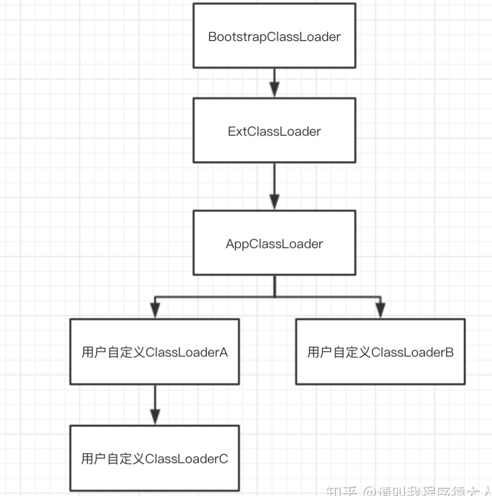

# 类加载器（常见面试）

## **面试官：请说说你理解的类加载器。**

------

我：通过一个类的**全限定名来获取描述此类的二进制字节流**这个动作放到**Java虚拟机外部去实现**，以便让应用程序**自己决定**如何去获取所需要的类。实现这个动作的代码模块称为**“类加载器”**。

## **面试官：说说有哪几种类加载器，他们的职责分别是什么，他们之前存在什么样的约定。**

------

我：emmmm，我在纸上边画边讲吧。

类加载的结构如下：



**BootstrapClassLoader**：启动类类加载器，它用来加载<JAVA_HOME>/jre/lib路径,**-**Xbootclasspath参数指定的路径以<JAVA_HOME>/jre/classes中的类。BootStrapClassLoader是由c++实现的。

**ExtClassLoader**：拓展类类加载器，它用来加载<JAVA_HOME>/jre/lib/ext路径以及java.ext.dirs系统变量指定的类路径下的类。

**AppClassLoader**：应用程序类类加载器，它主要加载应用程序ClassPath下的类（包含jar包中的类）。它是java应用程序默认的类加载器。

**用户自定义类加载器**：用户根据自定义需求，自由的定制加载的逻辑，继承ClassLoader，仅仅覆盖findClass（）即将继续遵守双亲委派模型。

在虚拟机启动的时候会初始化BootstrapClassLoader，然后在Launcher类中去加载ExtClassLoader、AppClassLoader，并将AppClassLoader的parent设置为ExtClassLoader，并设置线程上下文类加载器。

**Launcher**是JRE中用于启动程序入口main()的类，让我们看下Launcher的代码

```

public Launcher() {
        Launcher.ExtClassLoader var1;
        try {
            //加载扩展类类加载器
            var1 = Launcher.ExtClassLoader.getExtClassLoader();
        } catch (IOException var10) {
            throw new InternalError("Could not create extension class loader", var10);
        }

        try {
            //加载应用程序类加载器，并设置parent为extClassLoader
            this.loader = Launcher.AppClassLoader.getAppClassLoader(var1);
        } catch (IOException var9) {
            throw new InternalError("Could not create application class loader", var9);
        }
        //设置默认的线程上下文类加载器为AppClassLoader
        Thread.currentThread().setContextClassLoader(this.loader);
        //此处删除无关代码。。。
        }
```

上面画的几种类加载器是遵循**双亲委派模型**的，其实就是，当一个类加载器去加载类时先尝试让父类加载器去加载，如果父类加载器加载不了再尝试自身加载。这也是我们在自定义ClassLoader时java官方建议遵守的约定。

## **面试官插嘴：**ExtClassLoader为什么没有设置parent？

让我们看看下面代码的输出结果

```java
 public static void main(String[] args) throws ClassNotFoundException {
        ClassLoader classLoader = Test.class.getClassLoader();
        System.out.println(classLoader);
        System.out.println(classLoader.getParent());
        System.out.println(classLoader.getParent().getParent());
    }
```

看看结果是啥

```java
sun.misc.Launcher$AppClassLoader@18b4aac2
sun.misc.Launcher$ExtClassLoader@5a61f5df
null
```

因为BootstrapClassLoader是由c++实现的，所以并不存在一个Java的类，因此会打印出null，所以在ClassLoader中，null就代表了BootStrapClassLoader（有些片面）。

### 双亲委派模型的好处

双亲委派模型能**保证基础类仅加载一次**，不会让jvm中存在重名的类。比如String.class，每次加载都委托给父加载器，最终都是BootstrapClassLoader，都保证java核心类都是BootstrapClassLoader加载的，保证了java的安全与稳定性。

API不会被篡改

## **面试官：那自己怎么去实现一个ClassLoader呢？请举个实际的例子。**

------

我：好的（脸上笑嘻嘻，心里mmp）。

自己实现ClassLoader时只需要继承ClassLoader类，然后覆盖findClass（String name）方法即可完成一个带有双亲委派模型的类加载器。

我们看下ClassLoader#loadClass的代码

```java

protected Class<?> loadClass(String name, boolean resolve)
        throws ClassNotFoundException
    {
        synchronized (getClassLoadingLock(name)) {
            // 查看是否已经加载过该类，加载过的类会有缓存，是使用native方法实现的
            Class<?> c = findLoadedClass(name);
            if (c == null) {
                long t0 = System.nanoTime();
                try {
                    //父类不为空则先让父类加载
                    if (parent != null) {
                        c = parent.loadClass(name, false);
                    } else {
                    //父类是null就是BootstrapClassLoader，使用启动类类加载器加载
                        c = findBootstrapClassOrNull(name);
                    }
                } catch (ClassNotFoundException e) {
                    // 父类类加载器不能加载该类
                }

                //如果父类未加载该类
                if (c == null) {
                    // If still not found, then invoke findClass in order
                    // to find the class.
                    long t1 = System.nanoTime();
                    //让当前类加载器加载
                    c = findClass(name);
                }
            }
            return c;
        }
    }
```

经典的模板方法模式，子类只需要实现findClass，关心从哪里加载即可。

还有一点，parent需要自己设置哦，可以放在构造函数做这个事情。

## **面试官插嘴：**为什么不继承AppClassLoader呢？

我：因为它和ExtClassLoader都是Launcher的静态类，都是包访问路径权限的。

### 参考文章

[好怕怕的*类加载器*](https://zhuanlan.zhihu.com/p/54693308)