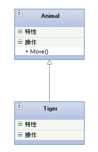
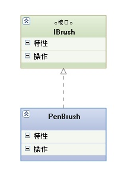
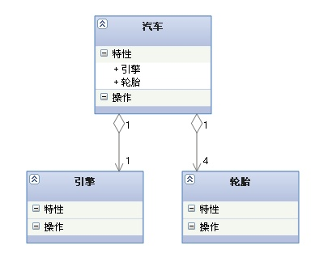
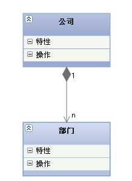
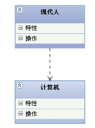
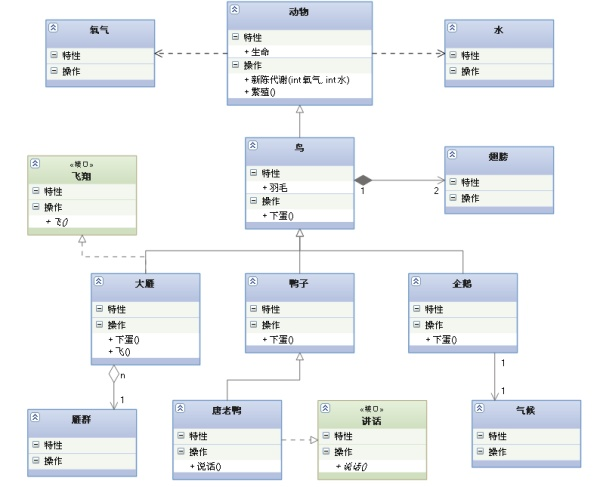

# UML类图(Class Diagrams)

## 1.基本概念

类图是根据用例图抽象成类，描述类的内部结构和类和类之间的关系，是一种静态结构图

## 2.常见的几种关系：

- 泛化（Generalization）
-  实现（Realization）
- 关联（Association)
- 聚合（Aggregation）
- 组合(Composition)
- 依赖(Dependency)

**各种关系的强弱顺序： 泛化 = 实现 > 组合 > 聚合 > 关联 > 依赖**

### 2.1 泛化

**【泛化关系】：是一种继承关系，表示一般与特殊的关系，它指定了子类如何继承父类的所有特征和行为。例如：老虎是动物的一种，即有老虎的特性也有动物的共性****即有老虎的特性也有动物的共性。**

描述方式：用三角形箭头加实线表示，箭头指向父类

### 2.2 实现

**【实现关系】：是一种类与接口的关系，表示类是接口所有特征和行为的实现。**

描述方式：用三角形箭头加虚线表示，箭头指向实现的接口

###2.3.关联

**【关联关系】：是一种拥有的关系，它使一个类知道另一个类的属性和方法；如：老师与学生，丈夫与妻子关联可以是双向的，也可以是单向的。双向的关联可以有两个箭头或者没有箭头，单向的关联有一个箭头。**

　 **【代码体现】：成员变量**

### 2.4 共享聚合

**【聚合关系】：是整体与部分的关系，且部分可以离开整体而单独存在。如车和轮胎是整体和部分的关系，轮胎离开车仍然可以存在。**

​      　**聚合关系是关联关系的一种，是强的关联关系；关联和聚合在语法上无法区分，必须考察具体的逻辑关系。**

​         **【代码体现】：成员变量**

###2.5.组合集合

**【组合关系】：是整体与部分的关系，但部分不能离开整体而单独存在。如公司和部门是整体和部分的关系，没有公司就不存在部门。**

​        **组合关系是关联关系的一种，是比聚合关系还要强的关系，它要求普通的聚合关系中代表整体的对象负责代表部分的对象的生命周期。**

　　**【代码体现】：成员变量**

　　**【箭头及指向】：带实心菱形的实线，菱形指向整体**

###2.6.依赖　　

　**【依赖关系】：是一种使用的关系，即一个类的实现需要另一个类的协助，所以要尽量不使用双向的互相依赖.**

**【代码表现】：局部变量、方法的参数或者对静态方法的调用**

**【箭头及指向】：带箭头的虚线，指向被使用者**

###2.7 各种类图关系

