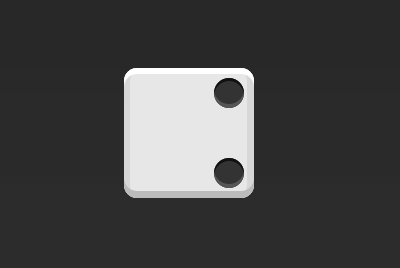
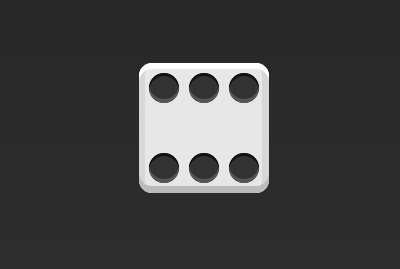

# flex布局示例（骰子的布局）

## 简介

骰子的一面，最多可以放置9个点。


下面，就来看看Flex如何实现，从1个点到9个点的布局


如果不加说明，本节的HTML模板一律如下。

> ```markup
> <div class="box">
>   <span class="item"></span>
> </div>
> ```

上面代码中，div元素（代表骰子的一个面）是Flex容器，span元素（代表一个点）是Flex项目。如果有多个项目，就要添加多个span元素，以此类推。

##  单项目

首先，只有左上角1个点的情况。Flex布局默认就是首行左对齐，所以一行代码就够了。


> ```css
> .box {
>   display: flex;
> }
> ```

设置项目的对齐方式，就能实现居中对齐和右对齐。


> ```css
> .box {
>   display: flex;
>   justify-content: center;
> }
> ```


> ```css
> .box {
>   display: flex;
>   justify-content: flex-end;
> }
> ```

设置交叉轴对齐方式，可以垂直移动主轴。


> ```css
> .box {
>   display: flex;
>   align-items: center;
> }
> ```


> ```css
> .box {
>   display: flex;
>   justify-content: center;
>   align-items: center;
> }
> ```


> ```css
> .box {
>   display: flex;
>   justify-content: center;
>   align-items: flex-end;
> }
> ```


> ```css
> .box {
>   display: flex;
>   justify-content: flex-end;
>   align-items: flex-end;
> }
> ```

##  双项目


> ```css
> .box {
>   display: flex;
>   justify-content: space-between;
> }
> ```


> ```css
> .box {
>   display: flex;
>   flex-direction: column;
>   justify-content: space-between;
> }
> ```


> ```css
> .box {
>   display: flex;
>   flex-direction: column;
>   justify-content: space-between;
>   align-items: center;
> }
> ```



> ```css
> .box {
>   display: flex;
>   flex-direction: column;
>   justify-content: space-between;
>   align-items: flex-end;
> }
> ```


> ```css
> .box {
>   display: flex;
> }
> 
> .item:nth-child(2) {
>   align-self: center;
> }
> ```


> ```css
> .box {
>   display: flex;
>   justify-content: space-between;
> }
> 
> .item:nth-child(2) {
>   align-self: flex-end;
> }
> ```

##  三项目


> ```css
> .box {
>   display: flex;
> }
> 
> .item:nth-child(2) {
>   align-self: center;
> }
> 
> .item:nth-child(3) {
>   align-self: flex-end;
> }
> ```

##  四项目


> ```css
> .box {
>   display: flex;
>   flex-wrap: wrap;
>   justify-content: flex-end;
>   align-content: space-between;
> }
> ```


HTML代码如下。

> ```markup
> <div class="box">
>   <div class="column">
>     <span class="item"></span>
>     <span class="item"></span>
>   </div>
>   <div class="column">
>     <span class="item"></span>
>     <span class="item"></span>
>   </div>
> </div>
> ```

CSS代码如下。

> ```css
> .box {
>   display: flex;
>   flex-wrap: wrap;
>   align-content: space-between;
> }
> 
> .column {
>   flex-basis: 100%;
>   display: flex;
>   justify-content: space-between;
> }
> ```

## 六项目



> ```css
> .box {
>   display: flex;
>   flex-wrap: wrap;
>   align-content: space-between;
> }
> ```


> ```css
> .box {
>   display: flex;
>   flex-direction: column;
>   flex-wrap: wrap;
>   align-content: space-between;
> }
> ```


HTML代码如下。

 ```markup
 <div class="box">
   <div class="row">
     <span class="item"></span>
     <span class="item"></span>
     <span class="item"></span>
   </div>
   <div class="row">
     <span class="item"></span>
   </div>
   <div class="row">
      <span class="item"></span>
      <span class="item"></span>
   </div>
 </div>
 ```

CSS代码如下。

 ```css
 .box {
   display: flex;
   flex-wrap: wrap;
 }
 
 .row{
   flex-basis: 100%;
   display:flex;
 }
 
 .row:nth-child(2){
   justify-content: center;
 }
 
 .row:nth-child(3){
   justify-content: space-between;
 }
 ```

##  九项目


 ```css
 .box {
   display: flex;
   flex-wrap: wrap;
 }
 ```

## 参考文章

[Flex 布局教程：实例篇](http://www.ruanyifeng.com/blog/2015/07/flex-examples.html)